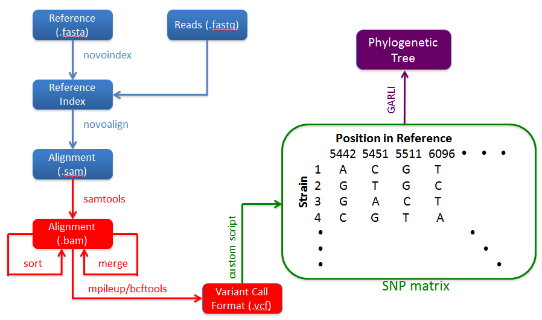

#SNP Pipeline Code Review

- Hugh Rand, Yan Luo, Jamie Pettengill, Errol Strain
- 2014-04-04

---

#Thanks To

- Yan - graciously letting me rearrange her code.
- Jamie - help testing and troubleshooting.
- Errol - prodding me along.
- John I. - an idea about how to do one thing.
- Fish - prodding on code reviews.

---

#What Has Gotten Done

- Rebuilt code, close to egg-ready
- Many pieces in place to review architecture

---

#Current Concerns

- Have I got all the right pieces?
    - Novoalign vs Bowtie2

- Am I going in the right direction?
    - Why do we do the pileups twice?
    - Alternate architecture?
        - VCF (and other) file generator
        - SNP matrix generator

- Are we done with changes for v0.1?
    - Documentation
    - Proper python egg

---

#Graphic Overview

---

#Text Overview

    0. Build reference sequence index (bowtie-build)
        reference sequence --> reference index

    1. Align sequences to reference (bowtie2-align)
           reference index, sample sequences --> sam files (1/sample)

    2. Convert sam to bam file, keep only mapped positions (samtools view)
            sam files --> bam files (1/sample)

    3. Sort bam file (samtools sort)
            bam file --> sorted bam file (1/sample)

    4. Get bcf file from pileup and bam file (samtools mpileup, bcftools view)
            sorted bam files, reference --> pileups (1/sample)
            pileups --> bcf files (1/sample)           

    5. Convert bcf to vcf (bcftools view, cutoff)
            bcf files --> vcf files (1/sample)   

    6a. Create list of high quality SNPs (snppipeline)
        vcf files, cutoffs --> snp list (1/run)

    6b. Create pileup (snppipeline - samtools mpileup)
        reference, bam files, cutoffs --> pileups (1/sample)

    6c. Create SNP matrix (snppipeline)
        #combine position from pileups and calls in snp calls?
        snp list, ??? --> SNP matrix (1/run)

---

#The next level down

    0. Create index file for reference
        bowtie-build   

    1. Align sequences to reference (bowtie2-align or just bowtie2 wrapper?)
        bowtie2-align -p 11 -q -x /Users/james.pettengill/Downloads/bowtie2-2.2.0/example/reference/lambda_virus -1 reads4_1.fq -2 reads4_2.fq > reads4.sam

    2. Convert to bam file with only mapped positions
        samtools view -bS -F 4 -o /Users/james.pettengill/Downloads/bowtie2-2.2.0/example/reads/reads1_F4.bam reads1.sam

    3. Convert to a sorted bam 
        samtools sort  reads4_F4.bam reads4_F4.sorted.bam

    4. Get a bcf file from the pileup and bam file
        samtools mpileup -uf /Users/james.pettengill/Downloads/bowtie2-2.2.0/example/reference/lambda_virus.fa reads1_F4.sorted.bam.bam | bcftools view -bvcg - > reads1_F4.bcf

    5. Convert bcf to vcf
        bcftools view reads1_F4.bcf | vcfutils.pl varFilter -D1000 > var1_F4.flt.vcf    

    6. Run samtools pileup in parallel and combine alignment and pileup to generate snp matrix
        ./snppipeline.py -n 10 -d ~/projects/snppipeline/test/testLambdaVirus/ -f path.txt -r lambda_virus.fa -l snplist.txt -a snpma.fasta -i True

---

#What Gets Consumed and Created

    0. reference/reference.fa --> reference/reference.fai

    1. reference/reference.fai, sample#/reads#_1.fq, sample#/reads#_2.fq --> sample#/reads#.sam

    2. sample#/reads#.sam sample#/reads#_unsorted.bam

    3. sample#/reads#_unsortd.bam reads#.bam

    4. reference/reference.fa, reads#.bam, maximum depth cutoff --> reads#.bcf

    5. reads#.bcf --> var#.flt.vcf    

    6. reference/reference.fa, path.txt --> snplist.txt, snpma.fasta

---

#Command line use

    !python
    if __name__ == '__main__':

        parser = argparse.ArgumentParser(description='Run SNP pipeline.')
        parser.add_argument('-n', '--n-processes',      dest='maxThread',        type=int,  default=4,                 help='Max number of concurrent jobs.')
        parser.add_argument('-d', '--mainPath',         dest='mainPath',         type=str,  default='', help='Path for all files')
        parser.add_argument('-r', '--Reference',        dest='Reference',        type=str,  default='reference.fasta', help='reference for mapping')
        parser.add_argument('-f', '--pathFileName',     dest='pathFileName',     type=str,  default='path.txt',        help='Path file name')
        parser.add_argument('-l', '--snplistFileName',  dest='snplistFileName',  type=str,  default='snplist.txt',     help='Snplist file name')
        parser.add_argument('-a', '--snpmaFileName',    dest='snpmaFileName',    type=str,  default='snpma.fa',        help='fasta file name')
        parser.add_argument('-b', '--bamFileName',      dest='bamFileName',      type=str,  default='reads.bam',       help='bam file name')
        parser.add_argument('-p', '--pileupFileName',   dest='pileupFileName',   type=str,  default='reads.pileup',    help='pileup file name')
        parser.add_argument('-v', '--verbose',          dest='verbose',          type=int,  default=1,                 help='Verbose flag (0=no info, 5=lots')
        parser.add_argument('-i', '--includeReference', dest='includeReference', type=bool, default=False,             help='Write reference sequence bases at SNP positions in fasta format.')
        parser.add_argument('-o', '--useOldPileups',    dest='useOldPileups',    type=bool, default=False,             help='Use available pileup files.')
        parser.add_argument(      '--DP',               dest='combinedDepthAcrossSamples',       type=int,   default=10,  help='Combined depth across samples.')
        parser.add_argument(      '--AF1',              dest='alleleFrequencyForFirstALTAllele', type=float, default=1.0, help='Allele frequency for first allele.')
        parser.add_argument(      '--AR',               dest='arFlagValue',                      type=float, default=1.0, help='AR flag value.')
        args_dict = vars(parser.parse_args())

        print("Running SNP pipeline with arguments:")
        pprint.pprint(args_dict)
        run_snp_pipeline(args_dict)

---

#Code History and Use

##History
- Errol - 1st version
- Yan   - 2nd version
- Hugh  - package creation
- Hugh  - speed

##Use
- sequence analysis and publication
- outbreak investigation

##Context
- CDC pipeline (Lee Katz)
    - https://github.com/lskatz/lyve-SET
- CVM (Yuansha Chen)
    - desire for a standard for SNP calling and phylogenetic tree analysis

---

#Goals
 
##Make it publishable
- Jamie's paper

##Make it shareable
- CDC 
- CVM
- International collaborators (Italy)

##Make it a package
- Reuseable and easily installed 
- Locked down (versioning and source code control) 
- Testable

##Get it publicaly vetted
- Prepare for challenge of use in regulatory setting

---

#Some background

- Running with anaconda
- Using python 2.7.6
- Using PyVCF
    - (If you want to get good at writing, then read a fair bit.)
    - (But, be judicious about what you read.)
    - reasonably well written.
    - does something useful for me.
        - $python -m easy_install PyVCF
        - Installing vcf_filter.py script to /home/hugh.rand/anaconda/bin
        - Installing vcf_melt script to /home/hugh.rand/anaconda/bin
 
---

#The 'ecosystem' - Part 1

- Python installation - Anaconda
- IDE - Spyder
- Code standards
    - PEP8
    - Google Code
- Testing
    - pylint
    - unittest
    - doctest
- Distribution
    - distutils
    - setuptools

---

#The 'ecosystem' - Part 2

- Documentation
    - PEP8
    - sphinx
- Source Code Control - git 
- Presentations
    - TBD

---

#What I did - Part 1

- Add comments
- Broke much of code out as functions
- Pythonify names of functions and variables
- Create tests
- All global variables gone
- Break up code into 'main' and utilities
- Move main 'script' into function
- Update argument passing package (2.6->2.7)
- Organize code as a python package
- Move from threads to processes
- General cleanup
- Add use of PyVCF
- Improve pylint score

---

#What I did - Part 2

- Add release versioning and all under version control
- Add new flags (includeReference, various parameters).

---

#What Remains to do

- Add new flags (verbose, useOldPileups).
- Trap keyboard interupts so can halt code cleanly.
- Turn it into an "Egg"
- Get it out on gitHub
- Move to SVN

---

#Package layout - snppipeline

- build, dist, doc, LICENSE.txt, MANIFEST.in
- notes, presentations
- README.txt
- setup.py
- snppipeline
    - README_developmentNotes
    - snppipeline.py
    - utils.py
- test
    - codeComparisonFiles
    - testAgonaMOM
    - testLambdaVirus
    - test_snppipeline.py
    - test_utils.py
- snppipeline.egg-info

---

#Functions

egrep 'def |\"\"\"' ../../snppipeline/snppipeline.py | sed -e 's/\"\"\"//'

egrep 'def |\"\"\"' ../../snppipeline/utils.py | sed -e 's/\"\"\"//'

- def run_snp_pipeline(options_dict):
    Create SNP matrix

- def pileup_wrapper(args):
    Wraps pileup to use multiple arguments with multiprocessing package.
- def pileup(filePath, options_dict):
    Run samtools to generate pileup.
- def get_consensus_base_from_pileup(base, length, data):
    Call the base for each SNP position
- def create_consensus_dict(pileup_file_path):
    Create a dict based on the information in a pileup file.
- def write_list_of_snps(file_path, snp_list_dict):    
    Write out list of snps for all samples to a single file.
- def write_reference_snp_file(reference_file_path, snp_list_file_path,
    Write out the snp fasta file for the reference.fasta using the snp
    
---

#Testing environment

- virtual machine
    - vmware - vmplayer
    - ubuntu
- install process
    - samtools
    - pyvcf
    - ????

---

#Where to put the code?

svn: https://xserve19.fda.gov/svn/bioin/mapping

---

#pylint

2014-04-01:
----------
- pylint snppipeline/utils.py | grep "rated"

    No config file found, using default configuration
    Your code has been rated at 7.72/10 (previous run: 7.72/10)

- pylint snppipeline/snppipeline.py | grep "rated"

    No config file found, using default configuration
    Your code has been rated at 5.68/10 (previous run: 5.68/10)

---

#Version control log 2014-04-02

- 1 * bba51bd - (HEAD, master) More work on presentation. (4 seconds ago) <Hugh Rand>
- 2 * 717597d - snppipeline.egg-info added to git tracking. (17 hours ago) <Hugh Rand>
- 3 * 2d84d4c - Clean up imports. (17 hours ago) <Hugh Rand>
- 4 * 440a340 - Presentation edited.  focus on documentation, egg building, and code review prep. (23 hours ago) <Hugh Rand>
- ...
- 89 * 15d15d0 - (tag: NoErrorOriginalCode) Now know how to run old code with data in test file. (5 weeks ago) <Rand>
- 90 * 6f70b77 - Minor changes to code. Brought in original single-file code for testing. (5 weeks ago) <Rand>
- 91 * a626adc - Working on pulling apart code into package. Added test data from Jamie. (5 weeks ago) <Rand>
- 92 * 63dabb1 - Initial set of code to get started. (6 weeks ago) <Rand>

---

#Making the code public

github?

---

#The tests

- Packages
    - unittest
    - doctest
- Some simple unit tests
- Two integration tests
    - lambda virus
    - agona

---

# Some Test Output - 1

    ./test/test_utils.py -v
    ...
    ok
    5 items had no tests:
        utils
        utils.pileup
        utils.pileup_wrapper
        utils.write_list_of_snps
        utils.write_reference_snp_file
    2 items passed all tests:
    3 tests in utils.create_consensus_dict
    9 tests in utils.get_consensus_base_from_pileup
    12 tests in 7 items.
    12 passed and 0 failed.
    Test passed.
    ok

---

# Some Test Output - 2

    ./test/test_snppipeline.py -v
    test_snppipeline_agona (__main__.Test)
    Run snppipeline with agona 5 samples example. ... [mpileup] 1 samples in 1 input files
    ...
    Match, Mismatch, Errors: 8, 0, 0
    ...
    ok
    test_snppipeline_lambda_virus (__main__.Test)
    Run snppipeline with synthetic virus example. ... [mpileup] 1 samples in 1 input files
    ...
    Match, Mismatch, Errors: 7, 0, 0
    ...
    ok

---

#BACKUP

---

#References

---

#Building Python Eggs

- Packages
    - distutils
    - setuptools
- Code
    - setup.py

#Python Eggs

A "Python egg" is a logical structure embodying the release of a specific
version of a Python project, comprising its code, resources, and metadata.
There are multiple formats that can be used to physically encode a Python egg,
and others can be developed. However, a key principle of Python eggs is that
they should be discoverable and importable. That is, it should be possible for
a Python application to easily and efficiently find out what eggs are present
on a system, and to ensure that the desired eggs' contents are importable.

The .egg format is well-suited to distribution and the easy uninstallation or
upgrades of code, since the project is essentially self-contained within a
single directory or file, unmingled with any other projects' code or resources. 
It also makes it possible to have multiple versions of a project simultaneously
installed, such that individual programs can select the versions they wish to
use.

(http://stackoverflow.com/questions/2051192/what-is-a-python-egg)

---

#CDC Pipeline

---

#Function call graph

pycallgraph

